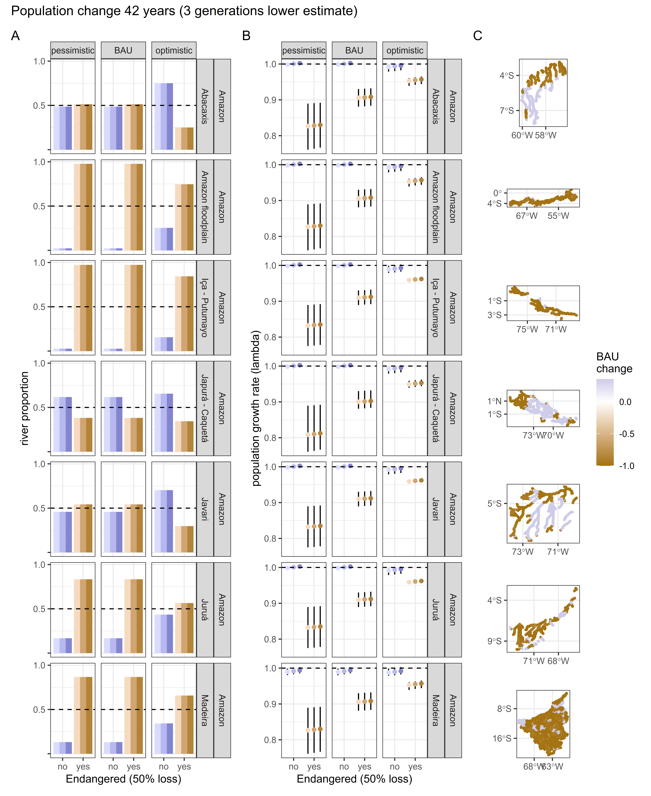
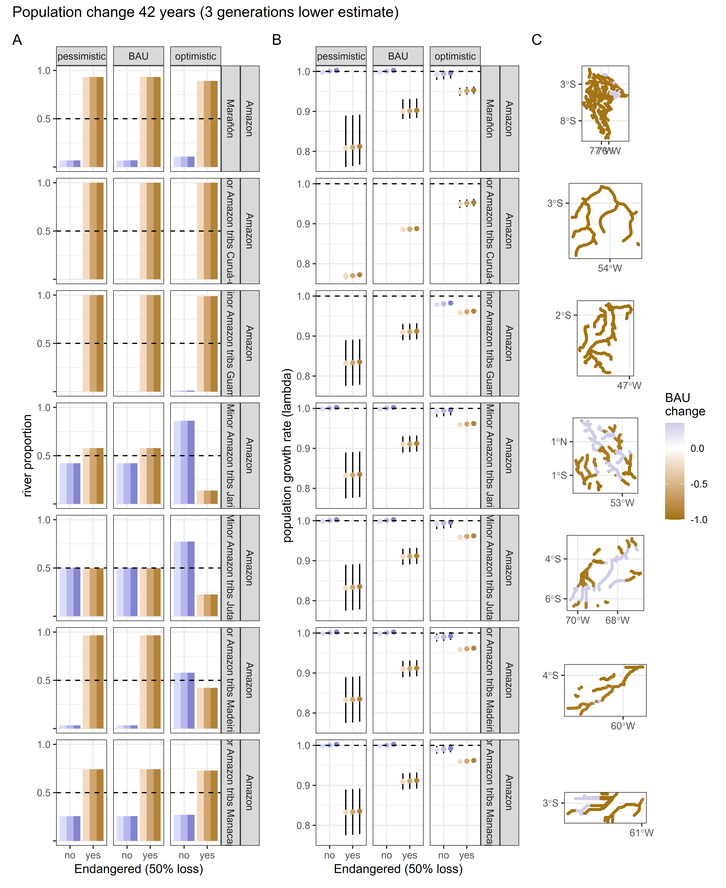

```{r setup, include=FALSE}
knitr::opts_chunk$set(echo = TRUE)
```

## Objective

Produce a series of figures that help validate population projection results.

## Question
Is *Podocnemis unifilis* an [Endangered](https://www.iucnredlist.org/) species?

To answer this question we use population projection matrices to understand the 
future impacts of current threats to populations.
This is an extension of [Norris et al 2019](https://doi.org/10.1016/j.biocon.2019.02.022) that includes:

- stochastic population projections 
- threats caused by human acessibility and actions that reduce river connectivity.

According to the IUCN Redlist criteria A3, 
population size reduction is a reduction which is projected, inferred or 
suspected to be met in the future (up to a maximum of 100 years). 
Here we use population projection matrices to 
obtain an index of abundance relevant to the taxon ("b") and consider
actual or potential levels of exploitation ("d"). 

This assessment is therefore based on criteria - A3bd. 

\newpage

## Load packages and data

### Packages
```{r load-packages, message=FALSE, warning=FALSE}
library(tidyverse)
library(sf)
library(patchwork)
```


\newpage

## Results
```{r final-palette, echo=FALSE}
myfillhex3 <- c("#DADCFF", "#B7B8F0", "#8385CD", 
                "#F6DABF", "#D0A570", "#B28339" 
                )
# Provide suggestions and details of possible options to develop a freely available online interactive map. The map needs to display a million points across an area of 8 million square kilometers. The suggestions should be for solutions that are viable without finance and using tools on a home based laptop, specifically github RStudio and R.
```

For each basin and subbasin there are composite figures that show: 

- Projected population changes. 
- Projected growth rates. 
- Maps of points with 50% population reductions over three generations. 

This is a wide ranging species, so it takes several pages to show all the results.
Projections are shown by river basin and include the major sub-basins.

\newpage 

### Amazon

Now plot.

```{r load-figure-p1, out.width = '95%', out.height = '95%', echo=FALSE}

```


\newpage 

```{r load-figure-p2, out.width = '95%', out.height = '95%', echo=FALSE}

```


\newpage 
