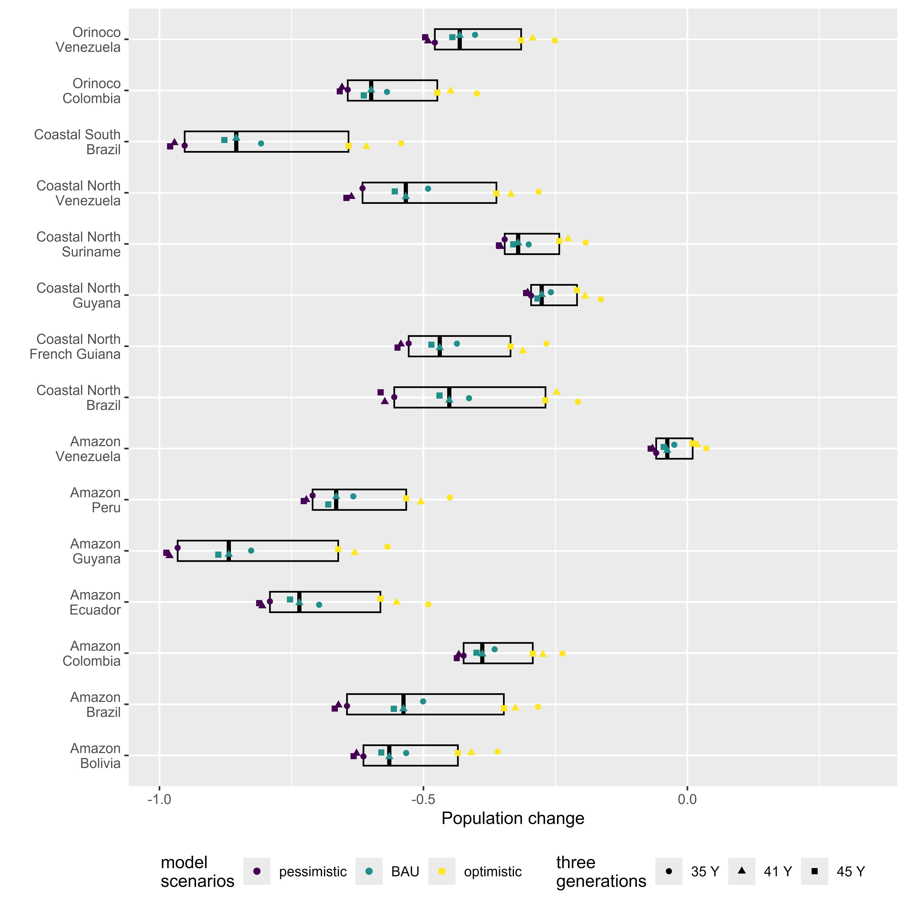

```{r, include = FALSE}
knitr::opts_chunk$set(
  collapse = TRUE,
  comment = "#>"
)
```

## Organization
Split into three parts: 

 - Projections    
 This section includes code and workflow used to calculate deterministic 
 and stochastic population projections with stage-based 
 Matrix Population Models.
 
 - Scenario integration    
 This section integrates the population projections across spatially 
 explicit conservation management scenarios.

 - Results    
 Key findings and graphics of the results obtained.

## Packages
The following packages are necessary to run the workflow, which integrates 
differrent data types, runs matrix population projections and produces results:
```{r load-packages, warning=FALSE, message=FALSE}
library(plyr)
library(dplyr)
library(tidyr)
library(tidyselect)
library(forcats)
library(Hmisc)
library(popdemo)
library(popbio)
library(Rcompadre)
library(Rage)
library(TACAR)
library(readxl)
library(ggplot2)
library(sf)
library(mgcv)
```


## Projections

### Section objectives

 - Projection parameters  
 Loads data frame with population parameters and explores the 
 structure of stage-based matrix models. 
 
 - Projection models    
 Run deterministic and stochastic projections, combine results and export 
 for future use. 
 
 - Model lookup    
 Summarise projection models and export for future use in scenario modelling.
 

### Projection parameters. 

Each row holds a unique set of parameters for a matrix population model.
This reflects diverse recovery (conservation action) and extinction (threat) scenarios.

```{r projection-params}
dt <- TACAR::pop01_param_poun()
# Population size constant.
nf <- 10
dt$adultF_n <- nf
# No data on density dependence for any South American freshwater turtle.
# Here include a generous 20% ceiling on maximum population increase.
ceiling_threshold <- nf + (nf * 0.2)
```

The first few rows should look like this....
```{r show-parameters, echo=FALSE, warning=FALSE, message=FALSE}
mydigits <- c(NA, NA, 1, 0, 0, 0, 2, 2, 2, 0, 0, 0, 2, 2, 0, 0 ,0, 2, 2, NA)
dplyr::slice_head(dt, n = 3)  |> 
  kableExtra::kbl(digits = mydigits) |>
  kableExtra::kable_styling(full_width = F,  latex_options = "hold_position")
```

Each row can be easily converted for use in a stage-based matrix population model. 
The following code shows how the third row becomes a stage-based matrix.
```{r mpm-example}
stage_names <- c("a1", "a2", "a3", "a4",
                   "b1", "b2", "b3", "b4",
                   "c1", "c2", "c3", "c4",
                   "d1", "d2", "d3", "d4")
vpop <- unlist(dt[3 , stage_names])
pop_mat <- matrix(vpop, byrow = TRUE, ncol=4)
dimnames(pop_mat) <- list(c("_1", "_2", "_3", "_4"),
                            c( "a", "b", "c", "d"))

```

The matrix should look like this:
```{r print-matrix, echo=FALSE}

knitr::kable(format(pop_mat, scientific=F), digits = 4) |> 
  kableExtra::column_spec(1, bold = TRUE) |>
  kableExtra::kable_styling(full_width = F,  latex_options = "hold_position")
```


This matrix includes information of population growth, survival and reproduction.

We can show the different matrix components (growth, survival and reproduction) 
by converting to the structure recommended by [COM(P)ADRE](https://compadre-db.org/). 
COM(P)ADRE is a global scale online repository for matrix population 
models (MPMs) and metadata on plants, animals, bacteria, viruses, algae, 
and fungi. There are two R packages developed specifically to
work with these MPMs: [Rcompadre](https://jonesor.github.io/Rcompadre/index.html) 
and [Rage](https://jonesor.github.io/Rage/) (Jones et. al. 2022, https://doi.org/10.1111/2041-210X.13792).
For more details see: 
https://cran.r-project.org/web/packages/Rage/vignettes/a01_GettingStarted.html

The code below creates a compadre database object from the matrix at line 
3 of the data.frame "dt", created earlier by the function "pop01_param_poun".
```{r rcompadre-example, warning=FALSE, message=FALSE}
meta <- data.frame(idNum = 3, 
                   SpeciesAccepted = dt[3 , 'species'],
                   type = dt[3 , 'type'], 
                   first_year = dt[3 , 'first_year']) 
stageInfo <- list(
  data.frame(
    MatrixClassOrganized = rep("active", 4),
    MatrixClassAuthor = c("eggs/hatchling", "juvenile-early", "juvenile-late", "adult")
  ))
# Simple full A matrix
l_pop_mat <- list(mpm = pop_mat)
x <- Rcompadre::cdb_build_cdb(mat_a = l_pop_mat, metadata = meta, stages = stageInfo)

# Seperate into U (growth/survival), F (sexual reproduction), C (clonal reproduction)
mat_u1 <- rbind(
  c(dt[3, 'a1'], dt[3, 'a2'], dt[3, 'a3'], 0),
  c(dt[3, 'b1'], dt[3, 'b2'], dt[3, 'b3'], dt[3, 'b4']),
  c(dt[3, 'c1'], dt[3, 'c2'], dt[3, 'c3'], dt[3, 'c4']),
  c(dt[3, 'd1'], dt[3, 'd2'], dt[3, 'd3'], dt[3, 'd4'])
)
mat_f1 <- rbind(
  c(0.0, 0.0, 0.0, dt[3, 'a4']),
  c(0.0, 0.0, 0.0, 0.0),
  c(0.0, 0.0, 0.0, 0.0), 
  c(0.0, 0.0, 0.0, 0.0)
)
mat_c1 <- rbind(
  c(0.0, 0.0, 0.0, 0.0),
  c(0.0, 0.0, 0.0, 0.0),
  c(0.0, 0.0, 0.0, 0.0), 
  c(0.0, 0.0, 0.0, 0.0)
)
l_u <- list(m_u = mat_u1)
l_f <- list(m_f = mat_f1)
l_c <- list(m_c = mat_c1)

my_comadre <- Rcompadre::cdb_build_cdb(
  mat_u = l_u, mat_f = l_f, mat_c = l_c,
  metadata = meta, 
  stages = stageInfo
)

```

Now we have the growth/survival and reproduciton matrixes, 
we can obtain many useful age related life history 
traits using functions in the package Rage (https://jonesor.github.io/Rage/).

The code below provides examples of generation time and life expectancy.
```{r gen-time}
# the time required for a population to 
# increase by a factor of R0 (the net reproductive rate)
Rage::gen_time(matU = matU(my_comadre)[[1]], matF(my_comadre)[[1]]) # 17.15
# the average parent-offspring age difference # 16.22
Rage::gen_time(matU = matU(my_comadre)[[1]], matF(my_comadre)[[1]], method = "age_diff")
# expected age at reproduction for a cohort 5.69
Rage::gen_time(matU = matU(my_comadre)[[1]], matF(my_comadre)[[1]], method = "cohort")

Rage::life_expect_mean(matU = matU(my_comadre)[[1]], start = 1)
# Add life expectancies of all stages to get overall longevity - 21.87 years
sum(Rage::life_expect_mean(Rcompadre::matU(my_comadre)[[1]], start = NULL))

```

```{r adult-survival, eval=FALSE, echo=FALSE}
# Logevity ranges between 20 to 70 years.
# Adult survival ranges between 0.9215 - 0.98153

# Anecdotal evidence suggests they can live up to 70 years 
# (Ricklefs 2010; Myhrvold et al. 2015; AnAGe 2023 - 
#online webserver https://genomics.senescence.info/species/index.html). 
# In captivity, individuals have been reported to live from 23.4 to 32.91
# years (Snider and Bowler 1992; Slavens and Slavens; Ricklefs 2010). 
# Using Iverson’s (in press) regression equation of longevity 
# [L = 2.741*(age at maturity) + 37.926] and the range of values for 
# female age at first reproduction (5 - 9 years), 
# the mean L was estimated at 57.11 years and to range between 51.63 
# and 62.60 years, which is relatively close to the anecdotal evidence.

# Graph of survival and age...
mat_u_92 <- rbind(
  c(dt[3, 'a1'], dt[3, 'a2'], dt[3, 'a3'], 0),
  c(dt[3, 'b1'], dt[3, 'b2'], dt[3, 'b3'], dt[3, 'b4']),
  c(dt[3, 'c1'], dt[3, 'c2'], dt[3, 'c3'], dt[3, 'c4']),
  c(dt[3, 'd1'], dt[3, 'd2'], dt[3, 'd3'], 0.92)
)
mat_u_93 <- rbind(
  c(dt[3, 'a1'], dt[3, 'a2'], dt[3, 'a3'], 0),
  c(dt[3, 'b1'], dt[3, 'b2'], dt[3, 'b3'], dt[3, 'b4']),
  c(dt[3, 'c1'], dt[3, 'c2'], dt[3, 'c3'], dt[3, 'c4']),
  c(dt[3, 'd1'], dt[3, 'd2'], dt[3, 'd3'], 0.93)
)
mat_u_94 <- rbind(
  c(dt[3, 'a1'], dt[3, 'a2'], dt[3, 'a3'], 0),
  c(dt[3, 'b1'], dt[3, 'b2'], dt[3, 'b3'], dt[3, 'b4']),
  c(dt[3, 'c1'], dt[3, 'c2'], dt[3, 'c3'], dt[3, 'c4']),
  c(dt[3, 'd1'], dt[3, 'd2'], dt[3, 'd3'], 0.94)
)
mat_u_95 <- rbind(
  c(dt[3, 'a1'], dt[3, 'a2'], dt[3, 'a3'], 0),
  c(dt[3, 'b1'], dt[3, 'b2'], dt[3, 'b3'], dt[3, 'b4']),
  c(dt[3, 'c1'], dt[3, 'c2'], dt[3, 'c3'], dt[3, 'c4']),
  c(dt[3, 'd1'], dt[3, 'd2'], dt[3, 'd3'], 0.95)
)
mat_u_96 <- rbind(
  c(dt[3, 'a1'], dt[3, 'a2'], dt[3, 'a3'], 0),
  c(dt[3, 'b1'], dt[3, 'b2'], dt[3, 'b3'], dt[3, 'b4']),
  c(dt[3, 'c1'], dt[3, 'c2'], dt[3, 'c3'], dt[3, 'c4']),
  c(dt[3, 'd1'], dt[3, 'd2'], dt[3, 'd3'], 0.96)
)
mat_u_97 <- rbind(
  c(dt[3, 'a1'], dt[3, 'a2'], dt[3, 'a3'], 0),
  c(dt[3, 'b1'], dt[3, 'b2'], dt[3, 'b3'], dt[3, 'b4']),
  c(dt[3, 'c1'], dt[3, 'c2'], dt[3, 'c3'], dt[3, 'c4']),
  c(dt[3, 'd1'], dt[3, 'd2'], dt[3, 'd3'], 0.97)
)
mat_u_98 <- rbind(
  c(dt[3, 'a1'], dt[3, 'a2'], dt[3, 'a3'], 0),
  c(dt[3, 'b1'], dt[3, 'b2'], dt[3, 'b3'], dt[3, 'b4']),
  c(dt[3, 'c1'], dt[3, 'c2'], dt[3, 'c3'], dt[3, 'c4']),
  c(dt[3, 'd1'], dt[3, 'd2'], dt[3, 'd3'], 0.98)
)
life_expect_mean_92 <- sum(Rage::life_expect_mean(matU = mat_u_92, 
                                                  start = NULL))
life_expect_mean_93 <- sum(Rage::life_expect_mean(matU = mat_u_93, 
                                                  start = NULL))
life_expect_mean_94 <- sum(Rage::life_expect_mean(matU = mat_u_94, 
                                                  start = NULL))
life_expect_mean_95 <- sum(Rage::life_expect_mean(matU = mat_u_95, 
                                                  start = NULL))
life_expect_mean_96 <- sum(Rage::life_expect_mean(matU = mat_u_96, 
                                                  start = NULL))
life_expect_mean_97 <- sum(Rage::life_expect_mean(matU = mat_u_97, 
                                                  start = NULL))
life_expect_mean_98 <- sum(Rage::life_expect_mean(matU = mat_u_98, 
                                                  start = NULL))

le <- c(life_expect_mean_92, life_expect_mean_93, life_expect_mean_94, 
        life_expect_mean_95, life_expect_mean_96, life_expect_mean_97, 
        life_expect_mean_98)
sv <- seq(0.92, 0.98, by = 0.01)

survival_longevity <- data.frame(life_expect_mean = le, 
                                 adult_survival = sv)

g1 <- gam(life_expect_mean ~ s(adult_survival, k=3), 
          method = "REML",
          data = survival_longevity)
plot(g1)
gam.check(g1)
summary(g1)
dfnew <- data.frame(adult_survival = seq(0.92, 0.98, by = 0.001))
preds <- mgcv::predict.gam(g1, dfnew, se.fit = TRUE)
dfnew$life_expect_gam <- preds$fit
dfnew$life_expect_gam_se <- preds$se
dfnew$life_expect_gam_lci <- preds$fit - (preds$se * 1.96)
dfnew$life_expect_gam_uci <- preds$fit + (preds$se * 1.96)
# showing mean longevity from Iverson and corresponding adult survival.
ggplot(survival_longevity, 
       aes(x = adult_survival, y = life_expect_mean)) + 
  geom_point() + 
  geom_hline(aes(yintercept = 57.1)) + 
  geom_vline(aes(xintercept = 0.9765)) +
  stat_smooth()
# Now for differernt years.
# 12.2 year (9 plus 3 nesting seasons)
mat_u_10y <- rbind(
  c(dt[3, 'a1'], dt[3, 'a2'], dt[3, 'a3'], 0),
  c(dt[3, 'b1'], dt[3, 'b2'], dt[3, 'b3'], dt[3, 'b4']),
  c(dt[3, 'c1'], dt[3, 'c2'], dt[3, 'c3'], dt[3, 'c4']),
  c(dt[3, 'd1'], dt[3, 'd2'], dt[3, 'd3'], 0.8415)
)
sum(Rage::life_expect_mean(matU = mat_u_10y, start = NULL))

# 20 year
mat_u_20y <- rbind(
  c(dt[3, 'a1'], dt[3, 'a2'], dt[3, 'a3'], 0),
  c(dt[3, 'b1'], dt[3, 'b2'], dt[3, 'b3'], dt[3, 'b4']),
  c(dt[3, 'c1'], dt[3, 'c2'], dt[3, 'c3'], dt[3, 'c4']),
  c(dt[3, 'd1'], dt[3, 'd2'], dt[3, 'd3'], 0.9215)
)
sum(Rage::life_expect_mean(matU = mat_u_20y, start = NULL))

# 30 year
mat_u_30y <- rbind(
  c(dt[3, 'a1'], dt[3, 'a2'], dt[3, 'a3'], 0),
  c(dt[3, 'b1'], dt[3, 'b2'], dt[3, 'b3'], dt[3, 'b4']),
  c(dt[3, 'c1'], dt[3, 'c2'], dt[3, 'c3'], dt[3, 'c4']),
  c(dt[3, 'd1'], dt[3, 'd2'], dt[3, 'd3'], 0.95244)
)
# Survival for population that lives less. 31.56 years
mat_u_30y <- rbind(
  c(dt[3, 'a1'], dt[3, 'a2'], dt[3, 'a3'], 0),
  c(dt[3, 'b1'], dt[3, 'b2'], dt[3, 'b3'], dt[3, 'b4']),
  c(dt[3, 'c1'], dt[3, 'c2'], dt[3, 'c3'], dt[3, 'c4']),
  c(dt[3, 'd1'], dt[3, 'd2'], dt[3, 'd3'], 0.9551627)
)
sum(Rage::life_expect_mean(matU = mat_u_30y, start = NULL))
# Survival for population that lives longer. 32.8 years
mat_u_30y <- rbind(
  c(dt[3, 'a1'], dt[3, 'a2'], dt[3, 'a3'], 0),
  c(dt[3, 'b1'], dt[3, 'b2'], dt[3, 'b3'], dt[3, 'b4']),
  c(dt[3, 'c1'], dt[3, 'c2'], dt[3, 'c3'], dt[3, 'c4']),
  c(dt[3, 'd1'], dt[3, 'd2'], dt[3, 'd3'], 0.9571827)
)
sum(Rage::life_expect_mean(matU = mat_u_30y, start = NULL))

# 50 year
mat_u_50y <- rbind(
  c(dt[3, 'a1'], dt[3, 'a2'], dt[3, 'a3'], 0),
  c(dt[3, 'b1'], dt[3, 'b2'], dt[3, 'b3'], dt[3, 'b4']),
  c(dt[3, 'c1'], dt[3, 'c2'], dt[3, 'c3'], dt[3, 'c4']),
  c(dt[3, 'd1'], dt[3, 'd2'], dt[3, 'd3'], 0.97339)
)

sum(Rage::life_expect_mean(matU = mat_u_50y, start = NULL))

# Mean 57.11 year
mat_u_57y <- rbind(
  c(dt[3, 'a1'], dt[3, 'a2'], dt[3, 'a3'], 0),
  c(dt[3, 'b1'], dt[3, 'b2'], dt[3, 'b3'], dt[3, 'b4']),
  c(dt[3, 'c1'], dt[3, 'c2'], dt[3, 'c3'], dt[3, 'c4']),
  c(dt[3, 'd1'], dt[3, 'd2'], dt[3, 'd3'], 0.976987)
)
sum(Rage::life_expect_mean(matU = mat_u_57y, start = NULL))

# Range
# 51.63 years
mat_u_51y <- rbind(
  c(dt[3, 'a1'], dt[3, 'a2'], dt[3, 'a3'], 0),
  c(dt[3, 'b1'], dt[3, 'b2'], dt[3, 'b3'], dt[3, 'b4']),
  c(dt[3, 'c1'], dt[3, 'c2'], dt[3, 'c3'], dt[3, 'c4']),
  c(dt[3, 'd1'], dt[3, 'd2'], dt[3, 'd3'], 0.974304)
)
sum(Rage::life_expect_mean(matU = mat_u_51y, start = NULL))


# 62.60 years
mat_u_62y <- rbind(
  c(dt[3, 'a1'], dt[3, 'a2'], dt[3, 'a3'], 0),
  c(dt[3, 'b1'], dt[3, 'b2'], dt[3, 'b3'], dt[3, 'b4']),
  c(dt[3, 'c1'], dt[3, 'c2'], dt[3, 'c3'], dt[3, 'c4']),
  c(dt[3, 'd1'], dt[3, 'd2'], dt[3, 'd3'], 0.97917)
)
sum(Rage::life_expect_mean(matU = mat_u_62y, start = NULL))

# 70
mat_u_70y <- rbind(
  c(dt[3, 'a1'], dt[3, 'a2'], dt[3, 'a3'], 0),
  c(dt[3, 'b1'], dt[3, 'b2'], dt[3, 'b3'], dt[3, 'b4']),
  c(dt[3, 'c1'], dt[3, 'c2'], dt[3, 'c3'], dt[3, 'c4']),
  c(dt[3, 'd1'], dt[3, 'd2'], dt[3, 'd3'], 0.98153)
)
sum(Rage::life_expect_mean(matU = mat_u_70y, start = NULL))

# Play with beta distribution
# Define the objective function to minimize the difference between desired and actual mean
make_beta_test2 <- function(survival_mean = NA, survival_min = NA,
                      survival_max = NA,
                      alpha_start = 40, beta_start = 40
){

  # Input validation
  if (is.na(survival_mean) || is.na(survival_min) || is.na(survival_max)) {
    stop("Please provide values for survival_mean, survival_min, and survival_max.")
  }
  if (survival_min >= survival_max || survival_mean < survival_min || survival_mean > survival_max) {
    stop("Invalid input: survival_min must be less than survival_max, and survival_mean must be within this range.")
  }


  # Set initial parameter values and constraints.
  # Initial guess for alpha and beta
  initial_params <- c(alpha_start, beta_start)
  # Ensure alpha and beta are positive
  lower_bounds <- c(1, 1)
  upper_bounds <- c(Inf, Inf)

  # Minimize the difference between desired and actual mean
  objective_function_normal <- function(params) {
    p_alpha <- params[1]
    p_beta <- params[2]
    mean_beta <- p_alpha / (p_alpha + p_beta)
    # Minimize the difference between desired and actual mean
    abs(mean_beta - survival_mean)
  }

  objective_function_alpha_less_than_beta <- function(params) {
    p_alpha <- params[1]
    p_beta <- params[2]
    mean_beta <- p_alpha / (p_alpha + p_beta)
    penalty <- ifelse(p_alpha >= p_beta, 1000, 0)
    abs(mean_beta - survival_mean) + penalty
  }

  # Choose the appropriate objective function based on alpha_start and beta_start
  if (alpha_start < beta_start) {
    objective_function <- objective_function_alpha_less_than_beta
  } else {
    objective_function <- objective_function_normal
  }

  # Optimize to find suitable alpha and beta
  optimization_result <- optim(initial_params, objective_function,
                               lower = lower_bounds, upper = upper_bounds,
                               method = "L-BFGS-B")
  # Extract optimized alpha and beta
  alpha_optimized <- optimization_result$par[1]
  beta_optimized <- optimization_result$par[2]

  # Generate random survival values using the optimized parameters
  sv <- rbeta(1000, alpha_optimized, beta_optimized)
  # Keep survival values within the desired range
  all_within_range <- sv[sv >= survival_min & sv <= survival_max]
  # Return data.frame.
  prop_within_range <- length(all_within_range) / length(sv)
  # Check if less than 50% are within range
  if (prop_within_range < 0.5) {
    warning("Less than 50% of survival values are within the desired range. Rescaling values.")

    # Rescale survival values to fit within the range
    # approximately normal
    within_range_rescaled <- scales::rescale(sv, to = c(survival_min, survival_max))

    # Create output data.frame with rescaled values
    # Make sure vectors have equal length.
  sq_range <- seq(max(length(sv), length(within_range_rescaled)))
  sq_opti <- seq(max(length(sv), length(alpha_optimized)))
  dfout <- data.frame(
      survival_values = sv,
      within_range = within_range_rescaled[sq_range],
      alpha = alpha_optimized,
      beta = beta_optimized
    )
  } else {
    # Create output dataframe with original values
  # Make sure vectors have equal length.
  sq_range <- seq(max(length(sv), length(all_within_range)))
  sq_opti <- seq(max(length(sv), length(alpha_optimized)))
  dfout <- data.frame(survival_values = sv,
                      within_range = all_within_range[sq_range],
                      alpha = alpha_optimized[sq_opti],
                      beta = beta_optimized[sq_opti])
  }
  
  return(dfout)
}

# Now test
adult_survival_default <- make_beta_test2(survival_mean = 0.95244, 
                                      survival_min = 0.9215, 
                                      survival_max = 0.98153)
hist(adult_survival_default$within_range)
mean(adult_survival_default$within_range, na.rm = TRUE)
# 0.9557724
# Here mean = 30 Y, min = 20 Y and max = 70 Y.
adult_survival_symmetric <- make_beta_test2(survival_mean = 0.95244, 
                                      survival_min = 0.9215, 
                                      survival_max = 0.98153, 
                                      alpha_start = 200, 
                                      beta_start = 200)
hist(adult_survival_symmetric$within_range)
mean(adult_survival_symmetric$within_range, na.rm = TRUE)
# 0.9523289
# Here more frequently to left of mean i.e. lower longevity.
adult_survival_left <- make_beta_test2(survival_mean = 0.95244, 
                                      survival_min = 0.9215, 
                                      survival_max = 0.98153, 
                                      alpha_start = 20, 
                                      beta_start = 40)
hist(adult_survival_left$within_range)
mean(adult_survival_left$within_range, na.rm = TRUE)
# Here more frequently to right of mean i.e. greater longevity.
adult_survival_right <- make_beta(survival_mean = 0.95244, 
                                      survival_min = 0.9215, 
                                      survival_max = 0.98153, 
                                      alpha_start = 40, 
                                      beta_start = 20)
hist(adult_survival_right$within_range)
mean(adult_survival_right$within_range, na.rm = TRUE)

hist(adult_survival_left, probability = TRUE, 
     main = "Distribution of Adult Survival", 
     xlab = "Survival Probability")
#Plot
hist(adult_survival_right$within_range, probability = TRUE, main = "Distribution of Adult Survival", xlab = "Survival Probability")
curve(dbeta(x, adult_survival_right$alpha[1], 
              adult_survival_right$beta[1]), add = TRUE, col = "red") 
hist(adult_survival_left$within_range, probability = TRUE, main = "Distribution of Adult Survival", xlab = "Survival Probability")
curve(dbeta(x, adult_survival_left$alpha[1], 
              adult_survival_left$beta[1]), add = TRUE, col = "red")  

# Now with half normal
make_half_normal_test <- function(survival_mean = NA, survival_min = NA,
                             survival_max = NA, n_samples = 1000,
                             sigma_start = NA, optimize_sigma = TRUE) {
  # Input validation
  if (is.na(survival_mean) || is.na(survival_min) || is.na(survival_max)) {
    stop("Please provide values for survival_mean, survival_min, and survival_max.")
  }
  if (survival_min >= survival_max || survival_mean < survival_min || survival_mean > survival_max) {
    stop("Invalid input: survival_min must be less than survival_max, and survival_mean must be within this range.")
  }

  mean_survival_ajusted <- survival_mean + (survival_mean * 0.05)
  if (mean_survival_ajusted > 0.99){
    mean_survival_ajusted <- 0.99
  }
  # Estimate sigma parameter of the half-normal distribution.
  # This estimated sigma ensures that when we generate random samples
  # from the half-normal distribution with this sigma, the mean of
  # those samples will be close to the desired mean_survival.
  if (optimize_sigma) {
    # Objective function to minimize the difference between desired and actual mean
    objective_function <- function(sigma) {
      hn <- extraDistr::rhnorm(n_samples, sigma)
      sv <- scales::rescale(hn, to = c(survival_min, survival_max))
      abs(mean(sv, na.rm = TRUE) - mean_survival_ajusted)
    }

    # Optimize to find the best sigma
    if (is.na(sigma_start)) {
      sigma_start <- sqrt(pi/2) / extraDistr::qhnorm(mean_survival_ajusted, lower.tail = FALSE) # Initial guess if not provided
    }
    # Set reasonable finite bounds for sigma based on the desired mean and range
    lower_bound_sigma <- 0.01 # Small positive value to avoid zero
    upper_bound_sigma <- 10 * sigma_start # Allow for a wide range of exploration
    optimization_result <- optim(sigma_start, objective_function,
                                 method = "Brent",
                                 lower = lower_bound_sigma, upper = upper_bound_sigma)
    sigma <- optimization_result$par
  } else {
    # Without optimizing, use the provided sigma or the default estimation if not provided
    sigma <- ifelse(is.na(sigma_start), sqrt(pi/2) / extraDistr::qhnorm(mean_survival_ajusted, lower.tail = FALSE), sigma_start)
  }

  # Generate half-normal samples
  hn_values <- extraDistr::rhnorm(n_samples, sigma)

  # Rescale survival values within the desired range
  survival_values <- scales::rescale(hn_values, to = c(survival_min, survival_max))
# sample_mean <- mean(all_within_range, na.rm = FALSE)
 # mean_diff_prop <- (survival_mean - sample_mean) / survival_mean
  #if (mean_diff_prop > 0.005) { 
  #  warning("Half-normal mean differs from desired mean. Shifting values.")
  #  mean_diff <- survival_mean - sample_mean
  #  all_within_range <- all_within_range + mean_diff
  #  all_within_range <- all_within_range[all_within_range >= survival_min & all_within_range <= survival_max]
    #add_n <- length(survival_values) - length(all_within_range)
    #to_add <- seq(from = survival_min, to = min(all_within_range, na.rm = TRUE), 
    #    length.out = add_n)
    #new_vals <- sample(to_add, add_n, replace = TRUE)
    #all_within_range <- c(all_within_range, new_vals)
  #  }
  # Create output dataframe with original values
  # Make sure vectors have equal length.
  sq_range <- seq(max(length(hn_values), length(survival_values)))
  dfout <- data.frame(hn_values = hn_values, 
                      survival_values = survival_values[sq_range]
                      )
  return(dfout)
}

# Generate survival values
survival_values_hn <- make_half_normal_test(survival_mean = 0.95244, 
                                      survival_min = 0.9215, 
                                      survival_max = 0.98153, 
                                      n_samples = 1000, 
                                      optimize_sigma = TRUE
                                      )
# Plot the distribution
hist(survival_values_hn$survival_values, probability = TRUE, 
     main = "Distribution of Adult Survival (Half-Normal)", 
     xlab = "Survival Probability")
 mean(survival_values_hn$survival_values, na.rm = TRUE)
 summary(survival_values_hn$survival_values)
```


We can also plot the life cycle diagram.
```{r plot-lifecycle}
Rage::plot_life_cycle(matA = matA(my_comadre)[[1]], 
                stages = c("eggs/hatchling", "juvenile-early", "juvenile-late", "adult"))
```


### Projection models.

Here stage-based matrix population models are run using functions 
available in packages [popbio](https://doi.org/10.18637/jss.v022.i11), [popdemo](https://cran.r-project.org/web/packages/popdemo/vignettes/popdemo.html) and [Rage](https://jonesor.github.io/Rage/). 
A series of life history metrics are then calculated from the 
matrix population models using functions available in 
Rage (Jones et. al. 2022).

#### Deterministic models

Deterministic models have no density-dependence and 
the population matrix is constant (i.e., vital rates do not change 
overtime (timestep to timestep)). Below the function "pop03_doproj" 
calculates deterministic projections and summaries for the 
population matrixes stored in the data.frame "dt", created previously 
with the function "pop01_param_poun" (see Norris et. al. 2019 
for full details and justification of the life stages used).
```{r projection-determ, eval=FALSE}
# project
dout <- plyr::ddply(dt, 
                    c("species", "type", "first_year","akey"), .fun =  pop03_doproj)
dout$arun <- 1

# Model summaries
model_sum <- dout |> 
  group_by(species, type, first_year, lambda, 
           gen_time, gen_age_diff, life_exp, life_exp_adult, mat_prob, eggs_to_adult) |> 
  summarise(fem_t0 = max(fem_t0), 
            fem_min = min(fem),
              fem_max = max(fem)) |> 
  ungroup()
lambda_n <- length(unique(model_sum$lambda)) # 50
lambda_mean <- mean(model_sum$lambda) # 0.9432
lambda_sd <- sd(model_sum$lambda) # 0.1506
lambda_min <- min(model_sum$lambda) # 0.4659
lambda_max <- max(model_sum$lambda) # 1.1539

# Export for future use
saveRDS(dout, "inst/other/dout.rds")

```


#### Stochastic models

Stochastic matrix population models use matrices to represent population 
dynamics, with the key feature of incorporating randomness or variability 
in vital rates (e.g. survival). This randomness reflects the inherent 
uncertainty and fluctuations in real-world systems, making these models 
more realistic than their deterministic counterparts. Here matrix 
switching is used to reflect variation in yearling survival over time.  
The matrix changes randomly at each iteration of the model to 
incorporate random environmental and/or demographic variation. 
In the code below, the function "pop03_doproj_stoch" calculates 
stochastic projections and summaries for the population matrixes stored 
in the data.frame "dt", created previously with the function 
"pop01_param_poun".

```{r projection-stoch, eval=FALSE}
# Stochastic
#data frame with runs for processing
#nruns <- 100 # 100 gives same pattern as 50
nruns <- 50
dt_stoch <- dt[rep(seq_len(nrow(dt)), nruns), ]
dt_stoch$arun <- rep(1:nruns, each = nrow(dt))
# Approx 90 - 120 minutes. 1,212,000 rows. 
# Projections quick. Summaries across stochastic matrices slow.
# 19:41 - 21:42
dout_stoch <- plyr::ddply(dt_stoch, 
                    c("arun", "species", "type", "first_year","akey"), 
                    .fun =  pop03_doproj_stoch)
table(dout_stoch$model)
table(dout_stoch$type)
model_sum_stoch <- dout_stoch |> 
  group_by(species, type, model, first_year, lambda, lambda_q75,
           gen_time, gen_age_diff_med, gen_age_q75, 
           life_exp_med, life_exp_adult_med, mat_prob_med, mat_prob_q75, 
           eggs_to_adult_med, eggs_to_adult_q75) |> 
  summarise(acount = n(), 
            fem_t0 = max(fem_t0), 
            fem_min = min(fem),
              fem_max = max(fem)) |> 
  ungroup()
# Export for future use
saveRDS(dout_stoch, "inst/other/dout_stoch.rds")
```

#### Combine results.
```{r projection-join, eval=FALSE}
dout <- readRDS("inst/other/dout.rds")
dout_stoch <- readRDS("inst/other/dout_stoch.rds")
# Combine data for plotting
dout_all <- dplyr::bind_rows(dout |> dplyr::select(arun, model, type, first_year, 
                                                   akey, ayear, 
                                                   lambda, gen_time, gen_age_diff, 
                                                   life_exp, life_exp_adult, 
                                                   mat_prob, eggs_to_adult,
                                            fem, fem_t0, fem_diff, change50_flag, 
                                            change30_flag,
                                            double_flag) |> 
                               dplyr::mutate(lambda_lcl = NA, lambda_ucl = NA, 
                                             lambda_sd = NA,  gen_sd = NA), 
                             dout_stoch |> dplyr::select(arun, model, type, first_year, 
                                                         akey, ayear, 
                                                         lambda, lambda_lcl, lambda_ucl, 
                                                         lambda_sd, gen_time, gen_sd, 
                                                         gen_age_diff, 
                                                   life_exp, life_exp_adult, 
                                                   mat_prob, eggs_to_adult,
                                            fem, fem_t0, fem_diff, change50_flag, 
                                            change30_flag,
                                            double_flag))
# Limit adult female number to maximum (20% above original for baseline).
summary(dout_all$fem)
#    Min.  1st Qu.   Median     Mean  3rd Qu.     Max. 
#       0        0        1     1389       11 16560701
dout_all[which(dout_all$fem > ceiling_threshold), 'fem' ] <- ceiling_threshold
# summary(dout_all$fem)
#     Min.   1st Qu.    Median      Mean   3rd Qu.      Max. 
# 0.000000  0.005763  1.485889  4.522590 11.240127 12.000000 
 
# Factors in right order
dout_all$modelf <- 1
dout_all[which(dout_all$model=="Stochastic uniform") , 'modelf'] <- 2
dout_all[which(dout_all$model=="Stochastic equal") , 'modelf'] <- 3
dout_all[which(dout_all$model=="Stochastic bad x2") , 'modelf'] <- 4
dout_all[which(dout_all$model=="Stochastic bad x4") , 'modelf'] <- 5
dout_all$modelf <- as.factor(dout_all$modelf)
levels(dout_all$modelf) <- c("Deterministic", "Stochastic uniform", 
                          "Stochastic equal", "Stochastic bad x2", 
                          "Stochastic bad x4")
unique(dout_all$modelf)
table(dout_all$modelf)
dout_all$typef <- 1
dout_all[which(dout_all$type=="female-hunt 2.5%") , 'typef'] <- 2
dout_all[which(dout_all$type=="female-hunt 5%") , 'typef'] <- 3
dout_all[which(dout_all$type=="female-hunt 10%") , 'typef'] <- 4
dout_all[which(dout_all$type=="female-hunt 25%") , 'typef'] <- 5
dout_all[which(dout_all$type=="female-hunt 50%") , 'typef'] <- 6
dout_all$typef <- as.factor(dout_all$typef)
levels(dout_all$typef) <- c("base", "female-hunt 2.5%", 
                            "female-hunt 5%",
                          "female-hunt 10%", "female-hunt 25%", 
                          "female-hunt 50%")
table(dout_all$typef)
# first year survival
dout_all$first_yearf <- as.factor(dout_all$first_year)
fylev <- paste("first-year\nsurvival\n", seq(0, 0.9, by = 0.1), sep = "")
levels(dout_all$first_yearf) <- fylev
# Export for future use. 17/6/2024 - 1,218,060 rows 21 columns.
saveRDS(dout_all, "inst/other/dout_all.rds")

```

### Model lookup

Derive model summaries to link with conservation management scenarios. 
The conservation management scenarios are used to help inform 
IUCN Red List and Green Status assessments.

- Red List guidelines    
"For example, upper and lower quartiles of the projected magnitude of 
the future reduction (i.e., reductions with 25% and 75% probability) 
may be considered to represent a plausible range of projected reduction." 
(IUCN, 2024 - section 4.5.2, p38).

- Green Status Presence    
Present when population is at least 1 as measured by lower quartile population.

- Green Status Viability    
Viable when not declining: lower quartile of lambda >= 1. 
A species is considered viable in a spatial unit if application of 
the Regional Red List Guidelines to the population in the spatial unit 
would result in a categorization of ‘Least Concern’ OR 
‘Near Threatened and Not Declining’.

- Green Status Functional    
Functional when population lower quartile is 10 times base level.

The code below adds projection results to each of the matrix population models.
```{r model-summaries, warning=FALSE, message=FALSE, eval=FALSE}
# load data. 14 August 2024 with 1218060 rows and 26 columns
dout_all <- readRDS("inst/other/dout_all.rds")
# 101 years, 5 model types (deterministic with 6060, stochastic with 6060 * 50), 
# 6 harvest levels, 10 first year levels
# Make unique model ID. boot mean is same as mean (at least to 6 decimal places)
# 300 projection models.
model_ref <- dout_all |>
  group_by(akey, modelf, typef, first_year, arun, lambda, gen_time, 
           gen_age_diff, life_exp, life_exp_adult, eggs_to_adult) |> 
  summarise(yc = length(unique(ayear))) |> 
  ungroup() |> 
  group_by(akey, modelf, typef, first_year) |>
  summarise(count_runs = length(unique(arun)), 
            count_years = min(yc),
            lambda_mean = mean(lambda), 
            lambda_min = min(lambda), 
            lambda_max = max(lambda), 
            lambda_sd = sd(lambda),
            lambda_boot_lcl = Hmisc::smean.cl.boot(lambda)["Lower"],
            lambda_boot_ucl = Hmisc::smean.cl.boot(lambda)["Upper"], 
            lambda_q25 = quantile(lambda, probs = 0.25, na.rm = TRUE),
            lambda_q75 = quantile(lambda, probs = 0.75, na.rm = TRUE), 
            gen_mean = mean(gen_time), 
            gen_med = median(gen_time),
            gen_min = min(gen_time), 
            gen_max = max(gen_time), 
            gen_sd = sd(gen_time),
            gen_boot_lcl = Hmisc::smean.cl.boot(gen_time)["Lower"],
            gen_boot_ucl = Hmisc::smean.cl.boot(gen_time)["Upper"], 
            gen_q25 = quantile(gen_time, probs = 0.25, na.rm = TRUE),
            gen_q75 = quantile(gen_time, probs = 0.75, na.rm = TRUE), 
            gen_age_mean = mean(gen_age_diff), 
            gen_age_med = median(gen_age_diff),
            gen_age_min = min(gen_age_diff), 
            gen_age_max = max(gen_age_diff), 
            gen_age_sd = sd(gen_age_diff),
            gen_age_boot_lcl = Hmisc::smean.cl.boot(gen_age_diff)["Lower"],
            gen_age_boot_ucl = Hmisc::smean.cl.boot(gen_age_diff)["Upper"], 
            gen_age_q25 = quantile(gen_age_diff, probs = 0.25, na.rm = TRUE),
            gen_age_q75 = quantile(gen_age_diff, probs = 0.75, na.rm = TRUE), 
            life_exp_mean = mean(life_exp), 
            life_exp_med = median(life_exp),
            life_exp_min = min(life_exp), 
            life_exp_max = max(life_exp), 
            life_exp_sd = sd(life_exp),
            life_exp_boot_lcl = Hmisc::smean.cl.boot(life_exp)["Lower"],
            life_exp_boot_ucl = Hmisc::smean.cl.boot(life_exp)["Upper"], 
            life_exp_q25 = quantile(life_exp, probs = 0.25, na.rm = TRUE),
            life_exp_q75 = quantile(life_exp, probs = 0.75, na.rm = TRUE), 
            life_exp_adult_mean = mean(life_exp_adult), 
            life_exp_adult_med = median(life_exp_adult),
            life_exp_adult_min = min(life_exp_adult), 
            life_exp_adult_max = max(life_exp_adult), 
            life_exp_adult_sd = sd(life_exp_adult),
            life_exp_adult_boot_lcl = Hmisc::smean.cl.boot(life_exp_adult)["Lower"],
            life_exp_adult_boot_ucl = Hmisc::smean.cl.boot(life_exp_adult)["Upper"], 
            life_exp_adult_q25 = quantile(life_exp_adult, probs = 0.25, na.rm = TRUE),
            life_exp_adult_q75 = quantile(life_exp_adult, probs = 0.75, na.rm = TRUE),
            eggs_to_adult_mean = mean(eggs_to_adult), 
            eggs_to_adult_med = median(eggs_to_adult),
            eggs_to_adult_min = min(eggs_to_adult), 
            eggs_to_adult_max = max(eggs_to_adult), 
            eggs_to_adult_sd = sd(eggs_to_adult),
            eggs_to_adult_boot_lcl = Hmisc::smean.cl.boot(eggs_to_adult)["Lower"],
            eggs_to_adult_boot_ucl = Hmisc::smean.cl.boot(eggs_to_adult)["Upper"], 
            eggs_to_adult_q25 = quantile(eggs_to_adult, probs = 0.25, na.rm = TRUE),
            eggs_to_adult_q75 = quantile(eggs_to_adult, probs = 0.75, na.rm = TRUE)
            
            ) |> 
  ungroup() |> 
  arrange(typef, first_year, modelf) |>
  mutate(modelid = paste(akey, as.numeric(modelf), sep = "_"), 
         modelkey = row_number()) |> 
  relocate(modelkey, modelid)

# Estimates of generation time for summary.
# Bienvenu and Legendre (2015) https://doi.org/10.1086%2F681104 - 
# defined as the mean age of mothers at birth.
# IUCN definition - is the mean age at which a cohort of individuals produce offspring.
gen_mean <- model_ref |> 
  filter(lambda_q75 >= 1, first_year < 0.5) |> pull(gen_age_mean) |> mean()
gen_median <- model_ref |> 
  filter(lambda_q75 >= 1, first_year < 0.5) |> pull(gen_age_mean) |> median()
gen_q25 <- model_ref |> 
  filter(lambda_q75 >= 1, first_year < 0.5) |> pull(gen_age_mean) |> 
  quantile(probs = 0.25)
gen_q75 <- model_ref |> 
  filter(lambda_q75 >= 1, first_year < 0.5) |> pull(gen_age_mean) |> 
  quantile(probs = 0.75)
gen_3 <- gen_mean * 3
gen_3_q25 <- gen_q25 * 3
gen_3_q75 <- gen_q75 * 3

# Add population changes.
model_ref2 <- model_ref |> left_join(dout_all |>
  filter(ayear %in% c(ceiling(gen_3), ceiling(gen_3_q25), ceiling(gen_3_q75), 100)) |> 
  group_by(akey, modelf, typef, first_year, ayear, arun) |> 
  summarise(fem_t0 = mean(fem_t0), 
            femnew = mean(fem),
            femnew_diff = mean(fem_diff)
  ) |> 
    ungroup() |> 
  group_by(akey, modelf, typef, first_year, ayear) |> 
  summarise(fem_t0 = mean(fem_t0), 
            fem = mean(femnew),
            fem_sd = sd(femnew, na.rm = TRUE), 
            fem_q25 = quantile(femnew, probs = 0.25, na.rm = TRUE),
            fem_q75 = quantile(femnew, probs = 0.75, na.rm = TRUE),
            fem_diff = mean(femnew_diff), 
            fem_diff_sd = sd(femnew_diff, na.rm = TRUE), 
            fem_diff_q25 = quantile(femnew_diff, probs = 0.25, na.rm = TRUE),
            fem_diff_q75 = quantile(femnew_diff, probs = 0.75, na.rm = TRUE)) |> 
  ungroup() |> 
    mutate(ayear = paste("t", ayear, sep="")) |>
  tidyr::pivot_wider(names_from = ayear, 
               values_from = c(fem, fem_sd, fem_q25, fem_q75, fem_diff, 
                               fem_diff_sd, fem_diff_q25, fem_diff_q75)) |> 
  arrange(typef, first_year, modelf)
)

# Add time to change by 50% and 30% 
model_ref3 <- model_ref2 |> 
  left_join(dout_all |> 
  filter(change50_flag == 1) |>
 group_by(akey, modelf, typef, first_year, arun, 
          change50_flag) |>
  summarise(acount = n(), 
            change50_yf = min(ayear), 
            change50_yl = max(ayear)) |> 
  ungroup() |> 
  group_by(akey, modelf, typef, first_year) |> 
  summarise(change50_ymean = floor(mean(change50_yf)), 
            change50_ysd = sd(change50_yf), 
            change50_yq25 = floor(quantile(change50_yf, probs = 0.25, na.rm = TRUE)),
            change50_yq75 = floor(quantile(change50_yf, probs = 0.75, na.rm = TRUE))) |> 
   ungroup()
) |> left_join(dout_all |> 
  filter(change30_flag == 1) |>
 group_by(akey, modelf, typef, first_year, arun, 
          change30_flag) |>
  summarise(acount = n(), 
            change30_yf = min(ayear), 
            change30_yl = max(ayear)) |> 
  ungroup() |> 
  group_by(akey, modelf, typef, first_year) |> 
  summarise(change30_ymean = floor(mean(change30_yf)), 
            change30_ysd = sd(change30_yf), 
            change30_yq25 = floor(quantile(change30_yf, probs = 0.25, na.rm = TRUE)),
            change30_yq75 = floor(quantile(change30_yf, probs = 0.75, na.rm = TRUE))) |> 
   ungroup()
)

# Export for future use
saveRDS(model_ref3, "inst/other/model_lookup.rds") 
write.csv2(model_ref3, "inst/other/model_lookup.csv", row.names = FALSE) 

```

## Scenario integration

### Section objective
Integrate point locations and population projections with conservation 
management scenarios.

Specifically: 

- Join points with conservation management scenarios and 
population projections.
- Generate data used for summaries. 
- Make summaries.

### Join with scenarios

Load data: points, projection model lookup table and scenarios.
```{r load-lookup-data}
# point data
# load points made previously in prep_river_points.Rmd. RIVORD 1 to 5. 
# Cropped to basins from Norris et. al. 2019.
ffr_1a5_poun_points_3395 <- sf::st_read(dsn = system.file("vector/poun_river_points_v2.gpkg", package="TACAR"),
                                    layer = "ffr_1a5_poun_points_3395")
#HydroBasin codes made previously in prep_river_points.Rmd.
ffr_1a5_poun_points_hb_3395 <- sf::st_read(dsn = system.file("vector/poun_river_points_hb_v1.gpkg", package="TACAR"),
                                    layer = "ffr_1a5_poun_points_hb_3395")
# quicker joining just data.
#geom column name
geocol <- attr(ffr_1a5_poun_points_hb_3395,"sf_column")
# join
ffr_1a5_poun_points_3395 <- ffr_1a5_poun_points_3395 |> 
  left_join(ffr_1a5_poun_points_hb_3395 |> data.frame() |> 
              dplyr::select(!tidyselect::all_of(geocol)))
# projections and scenarios
# model_lookup has results from 300 population projection models created previously
model_lookup <- readRDS(system.file("other/model_lookup.rds", package = "TACAR"))
# actions has scenarios for IUCN Red List and Green Status evaluations, 
# with link to river points and associated projection models
actions <- readxl::read_excel(system.file("other/Podocnemis_conservation_actions.xlsx", package = "TACAR"), 
                      sheet = "scenario_parameters", .name_repair = "universal")

```


Now join.
```{r join-scenarios, eval=FALSE}
# Here with 3 scenarios for each river point:-
# modelkey pessimistic, BAU, optimistic.
### 1060311 rows 6/8/2024
scenario_ffr_res <- ffr_1a5_poun_points_3395 |> data.frame() |> 
  #filter(subbasn == "Trombetas") |>
  mutate(Protected = if_else(All == 1, "yes", "no"), 
         Protected_cat = case_when(Indigenous == 1 ~ "TI", 
                                   Strict == 1 ~ "SP", 
                                   myuse == 1 ~ "SU", 
                                   .default = "no"
                                   ), 
         Accessible = if_else(access_new == 0, "no", "yes"), 
         Free_flowing = if_else(CSI >= 0.92, "yes", "no")
         ) |> left_join( 
           actions |> 
  filter(Podocnemis.modelling.scenario == "Protection") |> 
  tidyr::pivot_longer(cols = starts_with("modelkey"), names_to = "model_name", 
               values_to = "modelkey") |> 
  left_join(model_lookup, by = join_by(modelkey == modelkey) 
            ), 
  by = c("Protected" = "Protected", "Protected_cat" = "Protected_cat", 
         "Accessible" = "Accessible", 
         "Free_flowing" = "Free_flowing"), 
  relationship = "many-to-many"
           ) |> 
  filter(!is.na(lambda_mean)) |> # where points do not overlap new basins
  mutate(flag_b = paste(BASIN_NAME, subbasin, sep="_"))
# should be zero rows if join worked. 
test_join <- scenario_ffr_res |> 
  filter(is.na(lambda_mean)) |> nrow()
# This file is used in testmap. 1060311 rows, 169 columns 24/8/2024.
saveRDS(scenario_ffr_res, "inst/other/scenario_res_ffr1a5.rds")
```

## Results

### Section objective
Present key findings from the analysis.

### Load and summarise data.
```{r load-results}
fin <- system.file("other/scenario_res_ffr1a5.rds", package = "TACAR")
scenario_ffr_res <- readRDS(fin)
```

Make factors and other useful values.
```{r make-useful}
# Make factors
scenario_ffr_res$model_namef <- factor(scenario_ffr_res$model_name)
#levels(scenario_ffr_res$model_namef)
scenario_ffr_res$model_namef <- relevel(scenario_ffr_res$model_namef, ref = "modelkey_pessimistic")
scenario_ffr_res$modelidf <- factor(scenario_ffr_res$modelid)
# scale value range
diff_min <- min(scenario_ffr_res$fem_diff_t45, na.rm = TRUE)
diff_max <- max(scenario_ffr_res$fem_diff_t45, na.rm = TRUE)
```


A little test.
```{r make-frequency}
# Test with smaller subset.
df <- scenario_ffr_res |> 
  dplyr::filter(COUNTRY == "French Guiana")
# Unique groups
df |>
dplyr::group_by(COUNTRY, BASIN_NAME, reach_id_point,
         model_name, modelkey, modelid, typef) |> 
  dplyr::summarise(acount = dplyr::n()) |> 
  dplyr::arrange(dplyr::desc(acount))

# Frequency distribution of river points among scenarios.
df |> 
  dplyr::mutate(modelidf = forcats::fct_reorder(modelidf, lambda_mean)) |>
  dplyr::group_by(modelkey, modelidf, model_namef) |> 
  dplyr::tally() |>
  tidyr::pivot_wider(names_from = model_namef, 
                     values_from = n, values_fill = 0)
```

```{r randomized-iqr, eval=FALSE, echo=FALSE}
# Not used. This gives range but is very narrow
df_long <- scenario_ffr_res |>
dplyr::select(COUNTRY, BASIN_NAME, reach_id_point,
         model_name, modelkey, modelid, typef, 
         fem_t0, fem_t35, fem_t41, fem_t45) |>
  tidyr::pivot_longer(cols = c(fem_t35, fem_t41, fem_t45), 
                      names_to = "gen_t3", 
                      values_to = "fem_tot")

# Randomized resample to get quantile distribution.
# Sample Function
resample_and_calculate_change <- function(df, sample_percent = NA, 
                                          sample_size = NA, 
                                          col1, col2) {
  # sample
  if(!is.na(sample_size)){ 
    sampled_df <- df |> 
    dplyr::slice_sample(n = sample_size, replace = TRUE) 
    }else{
  sampled_df <- df |> 
    dplyr::slice_sample(prop = (sample_percent / 100)) 
    }
  # calculate change
  tot_tstart <- sum(sampled_df[ , col1]) 
  tot_tend <- floor(sum(sampled_df[ , col2])) 
  pop_change <- (tot_tend - tot_tstart) / tot_tstart
  return(pop_change)
}

set.seed(123)  # For reproducibility
# 1000 and 10000 give very similar result
res_random <- replicate(1000, 
                      resample_and_calculate_change(df = df_long, 
                                                    sample_percent = 1, 
                                                      col1 = "fem_t0", 
                                                    col2 = "fem_tot")) 
# -0.5060417
pop_change_mean <- mean(res_random)
# -0.5061052
pop_change_median <- median(res_random)
# -0.5077871 
pop_change_q25 <- quantile(res_random, probs =0.25)
# -0.504105
pop_change_q75 <- quantile(res_random, probs =0.75)

```


Summarise population changes.
```{r make-pop-change, message=FALSE, warning=FALSE}
df_country_basin <- scenario_ffr_res |> 
  #dplyr::filter(BASIN_NAME == "Coastal North") |> # track why have 1 Coastal South
  dplyr::filter(flag_exclude == 0) |>
  dplyr::mutate(modelidf = forcats::fct_reorder(modelidf, lambda_mean), 
                basin_country = paste(BASIN_NAME, COUNTRY, sep ="\n")) |> 
  dplyr::group_by(basin_country, COUNTRY, BASIN_NAME, 
                  model_namef) |> 
  dplyr::summarise(acount = dplyr::n(), 
                   tot_t0 = sum(fem_t0),
                   diff_t35 = (sum(fem_t35) - sum(fem_t0)) / sum(fem_t0),
                   diff_t41 = (sum(fem_t41) - sum(fem_t0)) / sum(fem_t0), 
                   diff_t45 = (sum(fem_t45) - sum(fem_t0)) / sum(fem_t0) 
  ) |> dplyr::ungroup() |> 
  dplyr::filter(acount > 21) |>
  tidyr::pivot_longer(cols = starts_with("diff_"), names_to = "gen_t3", 
                      values_to = "fem_diff")
# Make weights. Below does not help.
#df_country_basin$wt <- df_country_basin$acount / sum(df_country_basin$acount)
# make sure to avoid these
# |> 
#  filter(length_river > 21) |> 
 # droplevels() |>

# Now get interquartile range for all.
 df_iqr <- data.frame(
    y = median(df_country_basin$fem_diff),
    ymin = quantile(df_country_basin$fem_diff, probs = 0.25),
    ymax = quantile(df_country_basin$fem_diff, probs = 0.75)
  )
# Weighted interqantile range
mean_wt <- Hmisc::wtd.mean(x = df_country_basin$fem_diff, 
                              w = df_country_basin$acount)
iqr_wt_25 <- Hmisc::wtd.quantile(x = df_country_basin$fem_diff, 
                              w = df_country_basin$acount, probs = 0.25)
iqr_wt_75 <- Hmisc::wtd.quantile(x = df_country_basin$fem_diff, 
                              w = df_country_basin$acount, probs = 0.75)
change_value <- round(abs(mean_wt) * 100, 1)
change_q25 <- round(abs(iqr_wt_25) * 100, 1)
change_q75 <- round(abs(iqr_wt_75) * 100, 1)
# Total river lengths
river_tot <- df_country_basin |> 
  dplyr::group_by(basin_country, COUNTRY, BASIN_NAME, acount) |> 
  dplyr::summarise(atmp = dplyr::n()) |> 
  dplyr::ungroup() |> 
  dplyr::mutate(length_label = paste(round((acount / 1000), 1), "K km"))
# How much does the Brazilian Amazon represent? Pull values.
river_totkm <- river_tot |> 
  dplyr::pull(acount) |> sum() 
river_amazon_brazil <-   river_tot |>
  dplyr::filter(COUNTRY == "Brazil", BASIN_NAME == "Amazon") |> 
  droplevels() |> 
  dplyr::pull(acount) |> sum() 
river_amazon_brazil_prop <- round(((river_amazon_brazil / river_totkm) * 100), 1)

```

### Findings

 - Within 3 generations, the adult female population is predicted 
to decline by `r change_value`% in the future (25 and 75% quantile 
range: `r change_q25` - `r change_q75` % decline).

 - This is a conservative (best-case) estimate.    
 Endangered (A3bd), is threfore a precautionary IUCN Red List assessment.    
      - Important threats are not included (e.g. land use change Zalles et. al. 2021). 
      - Losses are potentially buffered by an overly generous 20% ceiling to increases in unaccesible/unhunted populations.
      - Population projections use the earliest likely breeding age. The age at first reproduction was set to 5 years (Norris et. al. 2019). 
      - Hunting of adult females was limited to 10% per year in the most pessimistic scenarios.
      - Hunting accessibility was limited to a distance of 48 km from locations with a human population density of 5 or more people per km^2^. This will underestimate impacts associated with threats such as large scale harvest around urban areas (Chaves et. al. 2021, Tregidgo et. al. 2017). 
 
 
#### Plot to check
 - Compare population changes across basin-country combinations.    
 Presenting the results visually can fascilitate a more detailed 
 understanding of the patterns in the results. 
 
 The code below makes a figure with population change on the x-axis 
and basin-country combination on the y-axis. This avoids sqashing 
long names, which would happen if the basin-country combinations were 
plotted along the x-axis.
```{r plot-country-basins, eval=FALSE}
# Define function to calculate IQR at given quantiles
iqr = function(z, lower = 0.25, upper = 0.75) {
  data.frame(
    y = median(z),
    ymin = quantile(z, lower),
    ymax = quantile(z, upper)
  )
}

stat_sum_df <- function(fun, geom="crossbar", ...) {
  stat_summary(fun.data = fun, colour = "black", geom = geom, width = 0.4, ...)
}

# Plot points summarised with standard IQR
fig_basin_country <- ggplot2::ggplot(data = df_country_basin, 
                mapping = aes(x = basin_country, y = fem_diff)) + 
  #stat_summary(fun.data = iqr) 
  geom_hline(yintercept = 0, colour = "black") +
  annotate(xmin=-Inf, xmax=Inf, 
           ymin = iqr_wt_25, ymax = iqr_wt_75,
            fill="grey80", geom = 'rect', alpha=0.4) + 
  geom_hline(yintercept = mean_wt, colour = "black", 
             linetype = "dashed") +
  stat_sum_df("iqr") + 
  geom_jitter(aes(shape = gen_t3, colour = model_namef), 
              width = 0.1, height = 0) + 
  scale_y_continuous(limits = c(diff_min, diff_max)) + 
  geom_label(data = river_tot, 
             aes(x = basin_country, y = 0.2, label = length_label)) +
  coord_flip() +
  scale_shape(name="three\ngenerations",
                         breaks=c("diff_t35", "diff_t41", "diff_t45"),
                         labels=c("35 Y", "41 Y", "45 Y")) + 
  scale_colour_viridis_d(name="threat-impact\nscenario",
                         breaks=c("modelkey_pessimistic", "modelkey_BAU", "modelkey_optimistic"),
                         labels=c("pessimistic", "BAU", "optimistic")) + 
  labs(y = "Population change", x = "") + 
  theme_bw() +
  theme(legend.position = "bottom")

# Export for future use
png(file = "vignettes/fig_basin_country_summary.png", bg = "transparent", 
    type = c("cairo"), 
    width = 8, height = 8, units = "in", res=600)
fig_basin_country
invisible(dev.off())

```

Check plot.

```{r fig-check-plot, echo=FALSE, out.width="80%", out.height="80%"}
 
```

In the above figure a population change of "-0.5" is 50% loss.
The shaded shapes show predicted population changes for each basin-country 
combination. 
The labels to the right show river lengths in thousands of 
kilometers (e.g. "22.2 K km" is 22,200 kilometers).
The vertical dashed line shows the overall mean value, and the verticle grey 
shaded area is the interquartile range (IQR - 25% and 75% quantile values). 
As the basin-country combinations cover different sized areas, 
estimates of overall mean and IQR are obtained using calculations 
weighted by the river length.

Within each basin-country combination, the horizontal black crossbars 
show the median and interquartile range of projection scenarios. 
These scenarios represent the impact of threats (e.g. hunting) across 
three generations. The impact of threats ranges from most severe 
("pessimistic"), Business-as-usual ("BAU"), to least severe ("optimistic").
Generation length was estimated from stage-based matrix population 
models (Bienvenu & Legendre, 2015). 
The scenario results include the mean (41 year), and the 
interquartile range of three generations (35 and 45 year, 
25% and 75% quantile values respectively).
Generation length estimation follows the IUCN definition: 
“Generation length is the average age of parents of the current cohort 
(i.e., newborn individuals in the population). 
Generation length therefore reflects the turnover rate of breeding 
individuals in a population..... Where generation 
length varies under threat, such as the exploitation of fishes, the 
more natural, i.e. pre-disturbance, generation length should be used.” 
(IUCN 2001, 2012).

The Amazon Basin in Brazil represents the largest proportion of 
rivers (`r river_amazon_brazil_prop`%). Considering the spatial variation 
in both threats and population genetics, it would probably be useful to 
include the Amazon Basin seperated into major basins (e.g. HydroBasin level 
4 - Madeira, Negro, etc). 
But the summaries presented here provide a general overview and enable 
robust assessment of the results. Additionally, the overall patterns do not 
change if the Amazon basin is seperated further.

#### By country

The code below generates a summary by country using the same 
data as the basin-country comparison. For each country 
the mean and interquartile range is calculated, with 
estimates weighted by the river length within each basin.

```{r summary-country}
df_river_couuntry <- river_tot |> 
  group_by(COUNTRY) |> 
  summarise(river_km = sum(acount))
  
df_wtd_country <- df_country_basin |> 
  group_by(COUNTRY) |> 
  summarise(mean_wtd = Hmisc::wtd.mean(x = fem_diff, w = acount), 
            iqr_wtd_25 = Hmisc::wtd.quantile(x = fem_diff, 
                              w = acount, probs = 0.25), 
            iqr_wtd_75 = Hmisc::wtd.quantile(x = fem_diff, 
                              w = acount, probs = 0.75))

df_wtd_country
```


## References
Bienvenu F, Legendre S. 2015. A new approach to the generation time in 
matrix population models. The American Naturalist. 185(6):834-43. 
https://doi.org/10.1086/681104.

Chaves, W.A., Valle, D., Tavares, A.S., Morcatty, T.Q. and Wilcove, D.S. 2021.
Impacts of rural to urban migration, urbanization, and generational 
change on consumption of wild animals in the Amazon. 
Conservation Biology, 35: 1186-1197. https://doi.org/10.1111/cobi.13663

IUCN. 2001. IUCN Red List Categories and Criteria: Version 3.1. 
IUCN Species Survival Commission. IUCN, Gland, Switzerland and 
Cambridge, U.K.

IUCN. 2012. IUCN Red List Categories and Criteria: Version 3.1. 
Second edition. IUCN, Gland, Switzerland and Cambridge, UK. 
Available at www.iucnredlist.org/technical-documents/categories-and-criteria

IUCN. 2024. Guidelines for Using the IUCN Red List Categories and Criteria. 
Version 16. Prepared by the Standards and Petitions Committee. 
Downloadable from https://www.iucnredlist.org/documents/RedListGuidelines.pdf.

Jones OR, Barks P, Stott IM, James TD, Levin SC, Petry WK, Capdevila P, 
Che-Castaldo J, Jackson J, Römer G, Schuette C, Thomas CC, 
Salguero-Gómez R. 2022. Rcompadre and Rage - two R packages to 
facilitate the use of the COMPADRE and COMADRE databases and 
calculation of life history traits from matrix population models.
Methods in Ecology and Evolution, 13, 770-781. doi:10.1111/2041-210X.13792.

Norris D, Peres CA, Michalski F, Gibbs JP. 2019.
Prospects for freshwater turtle population recovery are catalyzed 
by pan-Amazonian community-based management. 
Biological Conservation. 233:51-60.
https://doi.org/10.1016/j.biocon.2019.02.022

Stott, I. popdemo vignette: https://cran.r-project.org/web/packages/popdemo/vignettes/popdemo.html

Stott, I., Hodgson, D.J. and Townley, S. 2012.
popdemo: an R package for population demography using projection matrix 
analysis. 
Methods in Ecology and Evolution, 3: 797-802. https://doi.org/10.1111/j.2041-210X.2012.00222.x

Stubben, C., & Milligan, B. 2007. 
Estimating and Analyzing Demographic Models Using the popbio Package in R. 
Journal of Statistical Software, 22(11), 1–23. 
https://doi.org/10.18637/jss.v022.i11

Tregidgo, D. J., Barlow, J., Pompeu, P. S., de Almeida Rocha, M., & Parry, L. 2017. 
Rainforest metropolis casts 1,000-km defaunation shadow. 
Proceedings of the National Academy of Sciences, 114(32), 8655-8659.
https://doi.org/10.1073/pnas.161449911

Zalles V, Hansen Matthew C, Potapov Peter V, Parker D, et al. 2021. 
Rapid expansion of human impact on natural land in South America since 1985. 
Science Advances, 7: eabg1620. https://doi.org/10.1126/sciadv.abg1620
